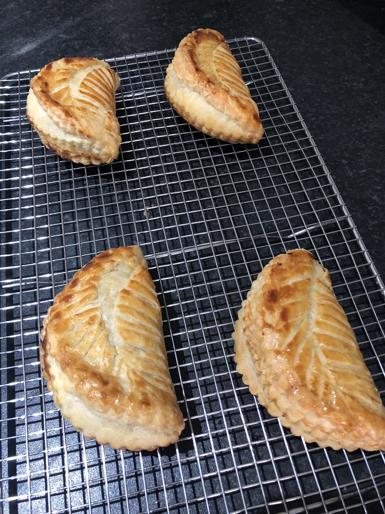
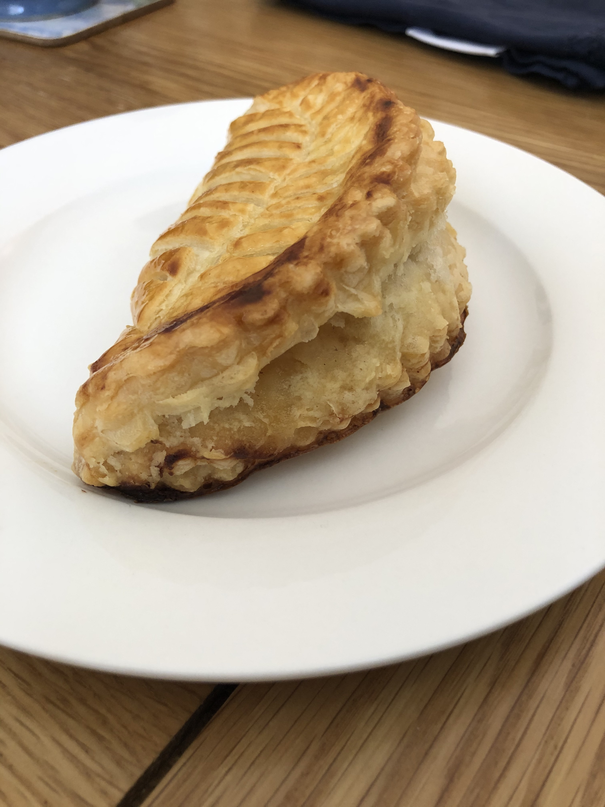

Today I made apple turnovers. This was the first time I'd ever made puff pastry from scratch.

In this recipe, I made inverse puff pastry and used my wife's home-made apple sauce for the filling.

Recipe from [French Pâtisserie: Master Recipes and Techniques from the Ferrandi School of Culinary Arts](https://www.amazon.co.uk/French-Pâtisserie-Techniques-Ferrandi-Culinary/dp/2080203185).
