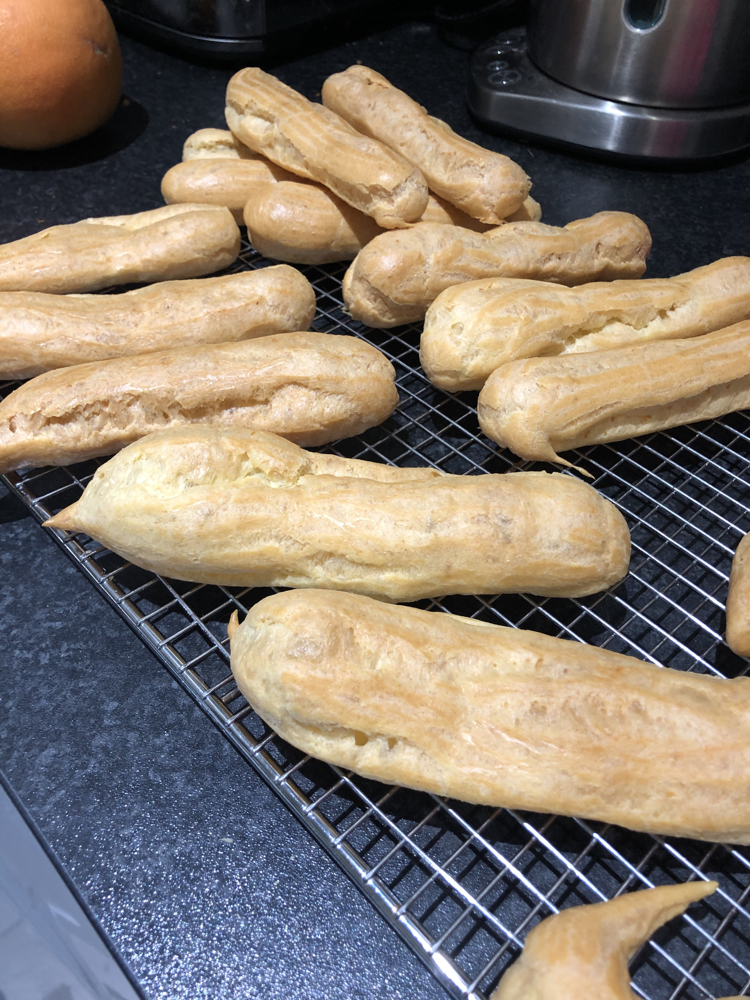
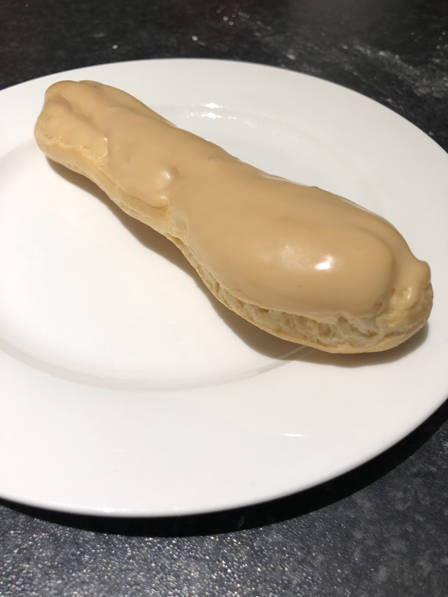

I made éclairs with a vanilla cream filling and a coffee fondant icing.

This was the first time I'd made choux pastry or pastry cream from stratch.

The choux pastry turned out well, though my piping was not clean nor consistent. The flavour of the pastry cream was great, but it did not set thick enough. The icing consistency was good, but needed actual coffee extract instead of substituting coffee for the water in the pouring fondant.

Recipe from [French Pâtisserie: Master Recipes and Techniques from the Ferrandi School of Culinary Arts](https://www.amazon.co.uk/French-Pâtisserie-Techniques-Ferrandi-Culinary/dp/2080203185).
