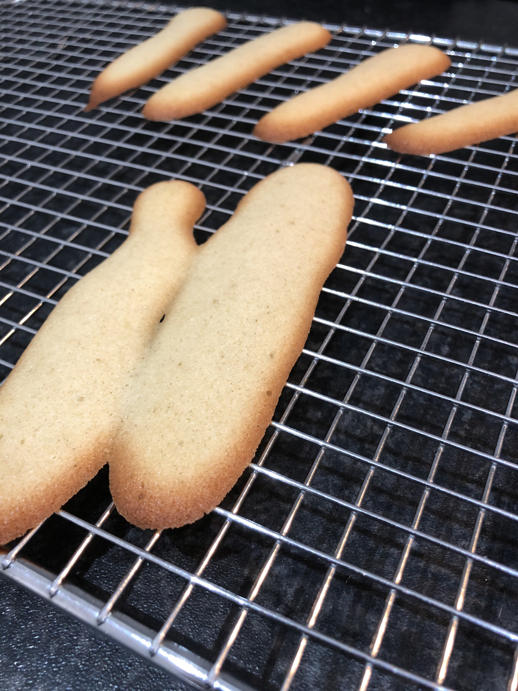
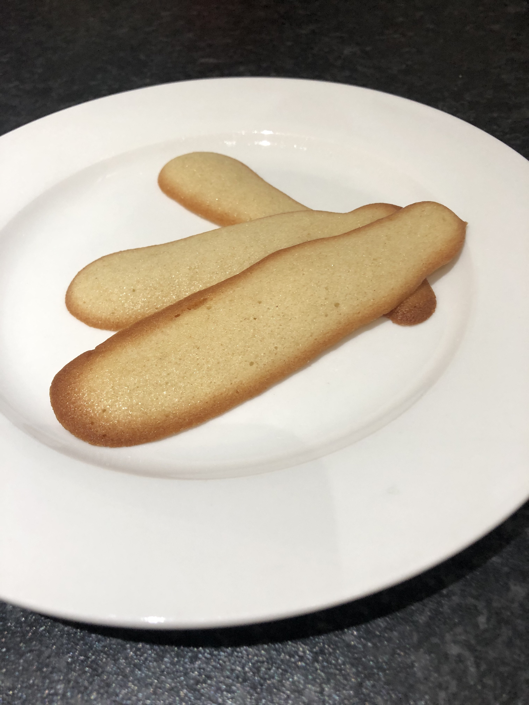

This morning I baked langues de chat (also called cat tongue cookies). They turned out well.

I didn't leave the butter long enough to come up to room temperature. I used a double-boiler to help warm it up ever so slightly to get everything to the correct consistency.

Recipe from [French Pâtisserie: Master Recipes and Techniques from the Ferrandi School of Culinary Arts](https://www.amazon.co.uk/French-Pâtisserie-Techniques-Ferrandi-Culinary/dp/2080203185).
