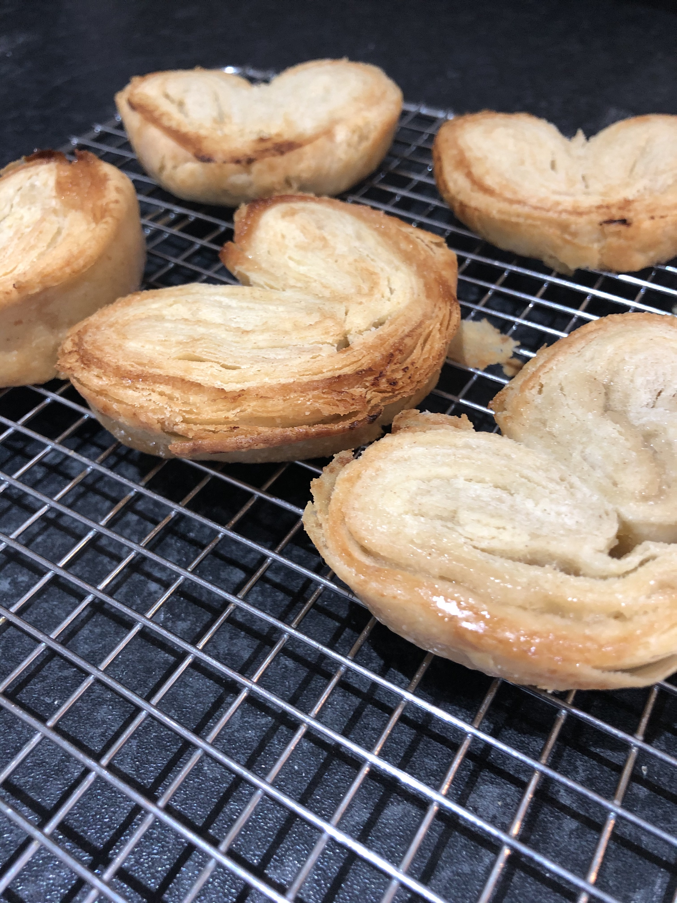
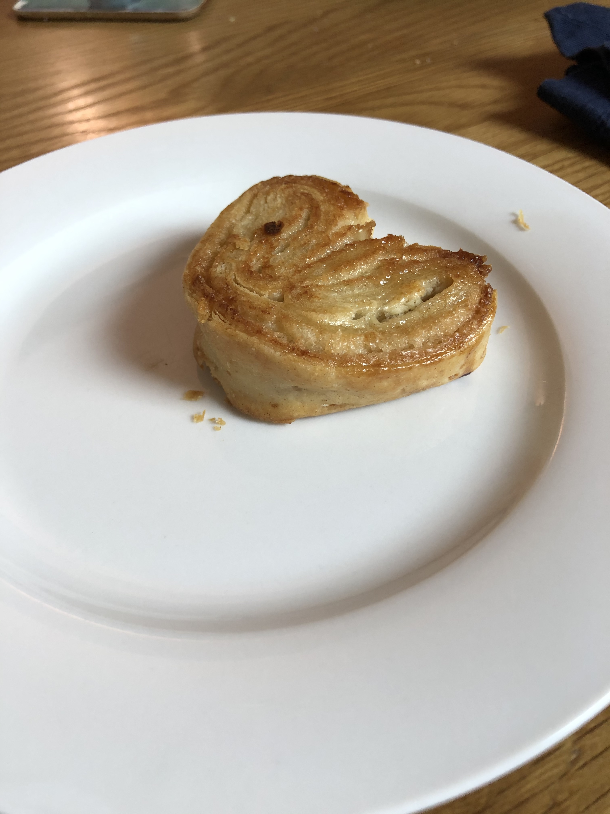

I baked palmiers (also called elephant ears) this morning for breakfast. They turned out pretty well.

This was the second time I've made inverse puff pastry, and it was definitely easier this time. I only did a light dusting of sugar and it could have used a fair bit more.

Recipe from [French Pâtisserie: Master Recipes and Techniques from the Ferrandi School of Culinary Arts](https://www.amazon.co.uk/French-Pâtisserie-Techniques-Ferrandi-Culinary/dp/2080203185).
