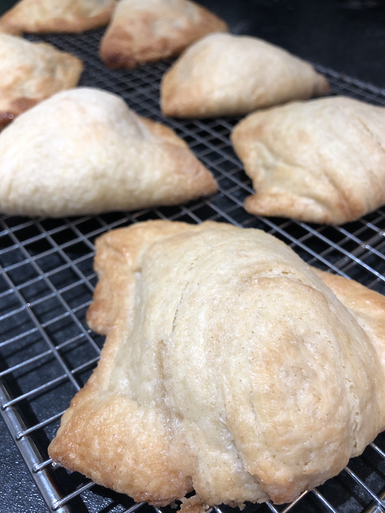
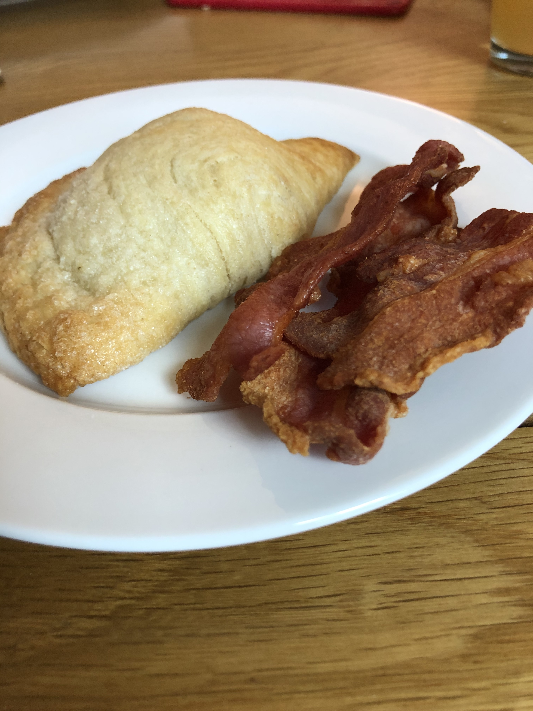

This morning I baked lemon cream turnovers with some streaky bacon for brekkie.

The inverse puff pastry turned out excellent this time. It was much easier each time I went to do a turn.

I made the lemon pastry cream the night before. I decided to do this to give it longer to chill so that it would set better than when I did the éclairs. Unfortunately I had the opposite problem and it over set.

Recipe from [French Pâtisserie: Master Recipes and Techniques from the Ferrandi School of Culinary Arts](https://www.amazon.co.uk/French-Pâtisserie-Techniques-Ferrandi-Culinary/dp/2080203185).
