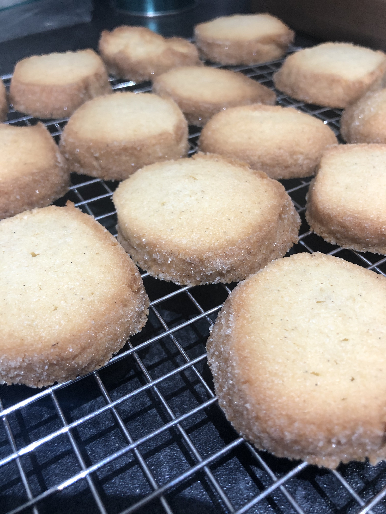
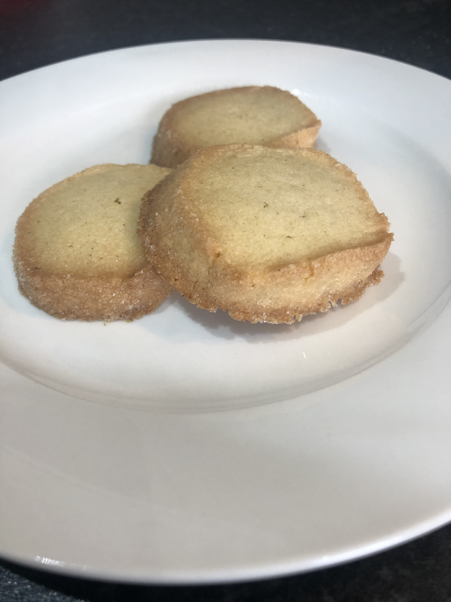

Biscuits were the bake of the day today. I made sablés diamants (a type of French shortbread). They taste much lighter than most Scottish shortbreads I've had.

They turned out quite well over all. The only thing I'd do differently is to try to get them more perfectly round.

Recipe from [French Pâtisserie: Master Recipes and Techniques from the Ferrandi School of Culinary Arts](https://www.amazon.co.uk/French-Pâtisserie-Techniques-Ferrandi-Culinary/dp/2080203185).
