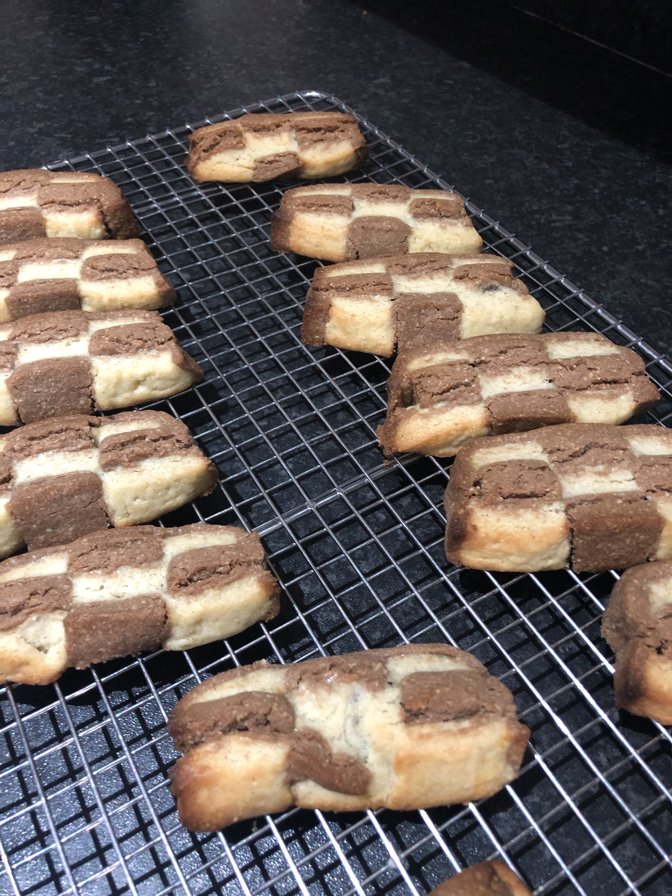
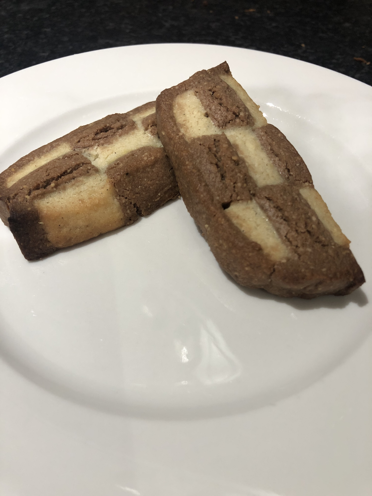

I made biscuits again today. They were checkerboard biscuits. They tasted good, especially with vanilla ice cream.

Unfortunately I rolled the short pastry dough too thin and cut the strips too wide. I only had enough extra chocolate dough to wrap three of the four sides. They were quite elongated rectangles instead of the squares they were supposed to be.

Recipe from [French Pâtisserie: Master Recipes and Techniques from the Ferrandi School of Culinary Arts](https://www.amazon.co.uk/French-Pâtisserie-Techniques-Ferrandi-Culinary/dp/2080203185).
