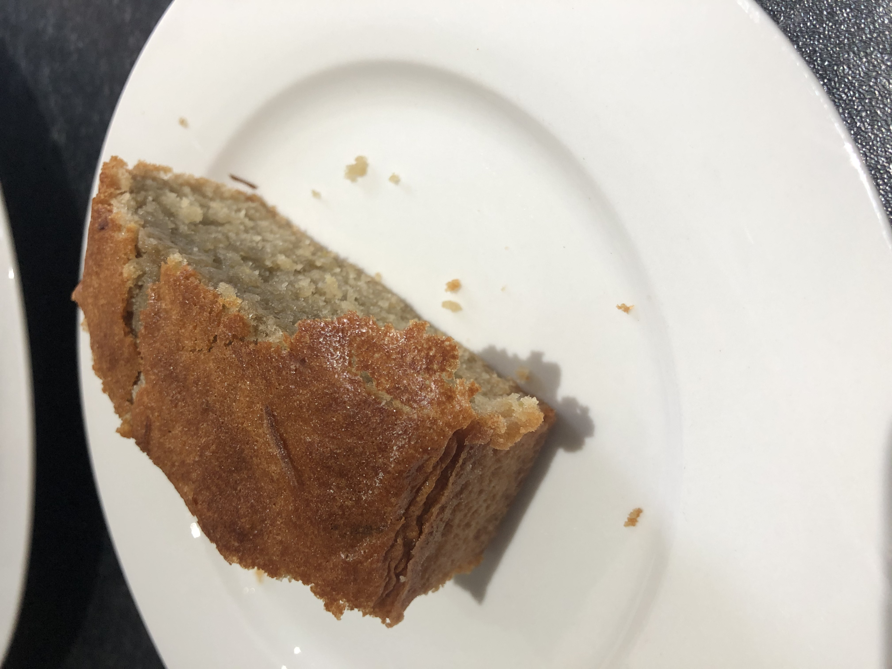

I made a lemon loaf cake.

To make this recipe, I also needed to make my own almond paste from scratch. That took a fair bit of work and made a large batch.

The loaf cake ended up slightly under-baked. But it had an excellent exterior.

Recipe from [French Pâtisserie: Master Recipes and Techniques from the Ferrandi School of Culinary Arts](https://www.amazon.co.uk/French-Pâtisserie-Techniques-Ferrandi-Culinary/dp/2080203185).
